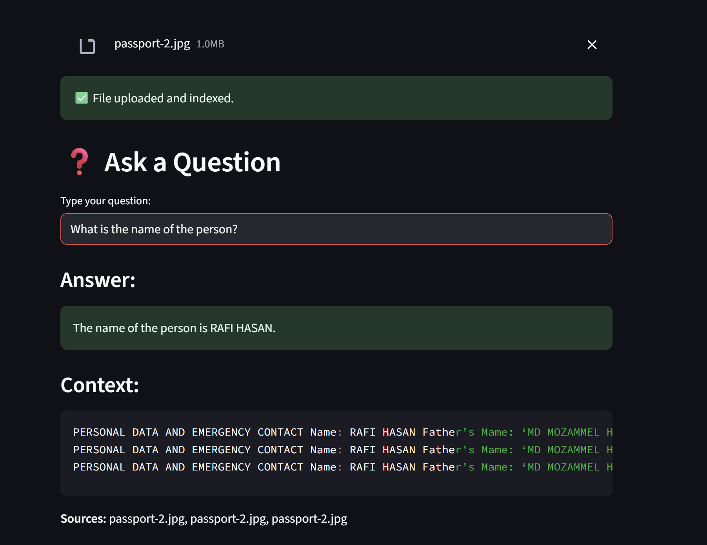

# 📚 Retrieval-Augmented Generation (RAG) Chatbot

RAG based Generative AI chatbot for extracting information from any documents such as ".pdf", ".docx" , ".txt" and so on.

---

## 🚀 Features

✅ Upload and parse:
- `.pdf`, `.docx`, `.txt`, `.csv`, `.jpg`, `.png`, `.db`

✅ Extract and clean text (incl. OCR for images)

✅ Embed using SentenceTransformers (MiniLM)

✅ Store in FAISS vector database

✅ Ask natural language questions

✅ Returns answers with source and context

✅ Built with FastAPI

✅ Streamlit UI for simple interaction

---

## 📁 Folder Structure

```
GenAI_chatbot/
├── main.py
├── document_loader.py
├── vector_store.py
├── streamlit_ui.py
├── temp/
├── requirements.txt
├── .env
├── README.md
```

---

## ⚙️ Setup Instructions

### 1. Clone the Repository

```bash
git clone <your-repo-url>
cd rag-chatbot
```

### 2. Set Up Virtual Environment

```bash
python -m venv venv
source venv/bin/activate  # Windows: venv\Scripts\activate
```

### 3. Install Dependencies

```bash
pip install -r requirements.txt
```

### 4. Add Environment Variables

Create a `.env` file like this:

```
Groq_API_KEY=your_GROQ_KEY_here
```

---

## 🏃 Run the Backend API (FastAPI)

```bash
uvicorn main:app --reload
```

Open your browser at:  
[http://127.0.0.1:8000/docs](http://127.0.0.1:8000/docs)

Use the `/upload` and `/query` endpoints to upload documents and ask questions.

or, Go to [http://127.0.0.1:8000/docs#/default/upload_upload_post] and upload file manually.

---

## 🌐 Bonus: Streamlit UI (Optional)

Run the Streamlit app:

```bash
streamlit run streamlit_ui.py
```

This gives you a simple web interface to:
- Upload documents
- Ask questions
- View the AI's answer and document context

---

## 🧪 Supported File Types

| Format | Parser |
|--------|--------|
| `.pdf` | `pdfplumber` |
| `.docx` | `python-docx` |
| `.txt` | `open()` |
| `.csv` | `pandas.read_csv()` |
| `.jpg`, `.png` | `pytesseract` OCR |
| `.db` | `sqlite3` table dump |

---

## 📤 Example API Usage (via Swagger UI)

1. Upload a file with `/upload`
2. Ask a question with `/query`:

```json
{
  "question": "What is the name of the person in the passport?"
}

--Response--

{
  "answer": "The name of the person in the passport is RAFI HASAN.",
  "context": "NEW SEN PARA, (ERSHAD 1 ROAD), RANCPUR SADAR, KOTWALI, RANGPUR Tle Wo: aua7sssa792 ii BY 0642950 alesis aya /PasspoRT No. MiD_N IURUL HUDA y iif = Deputy Director by iy Bir: age gt bie ey E f i mmigrat DAG a P ass Ors ; ‘Soa ll Lee ap.Dic Of Bare sce m2 Sit %\nNEW SEN PARA, (ERSHAD 1 ROAD), RANCPUR SADAR, KOTWALI, RANGPUR Tle Wo: aua7sssa792 ii BY 0642950 alesis aya /PasspoRT No. MiD_N IURUL HUDA y iif = Deputy Director by iy Bir: age gt bie ey E f i mmigrat DAG a P ass Ors ; ‘Soa ll Lee ap.Dic Of Bare sce m2 Sit %\nPERSONAL DATA AND EMERGENCY CONTACT Name: RAFI HASAN Father's Mame: ‘MD MOZAMMEL HOSSAIN Sodher’s Name: _ MOST SHAHIN AKHTER JAHAN CHOWDHURY Spouse's Mare: NA Parnanent Address: HOUSE#25, ROADS, NEW SEN PARA, (ERSHAD ROAD), RANGPUR SADAR, KOTWALI, RANGPUR < Pe Thi | tyethtaat Ton eit Hetiee ytat ay hit PT Lig Mame: MD JUBAER HASSAN ‘RIVADH ak Pee ; Relationship: BROTHER Address: HOUSERS, ROADEOS, NEW SEN PARA, (ERSHAD 1 ROAD), RANCPUR SADAR, KOTWALI, RANGPUR Tle Wo: aua7sssa792 ii BY 0642950 ale",
  "sources": [
    "passport-2.jpg",
    "passport-2.jpg",
    "passport-2.jpg"
  ]
}

```
---
## Screenshots




---

## ✅ To-Do / Bonus Features

- [x] Core file ingestion + chunking + RAG flow
- [x] OCR + DB support
- [x] FastAPI endpoints
- [x] Clean response formatting
- [x] Streamlit interface
- [ ] Dockerize the app
- [ ] Deploy online (Render, HuggingFace, etc.)
- [ ] Multi-document merging support

---

## 🧠 Credits

Built with:
- Python
- FastAPI
- FAISS
- HuggingFace SentenceTransformers
- OpenAI API
- pytesseract
- Streamlit

---

## 🛡️ License

MIT License